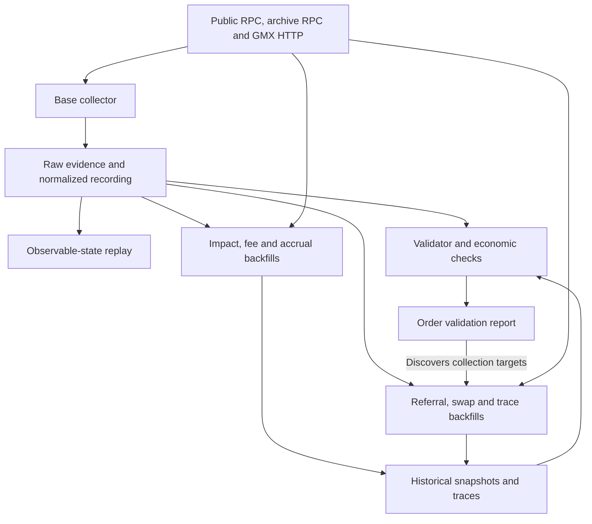
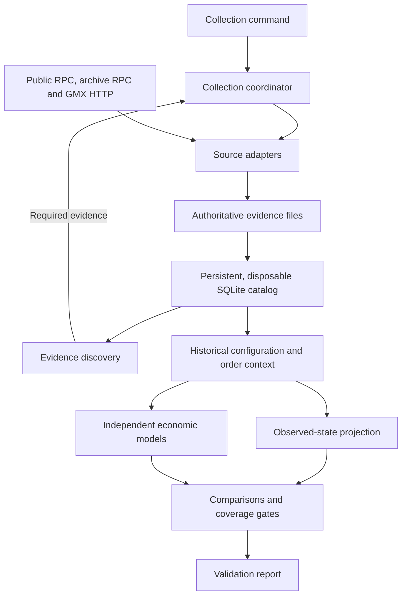
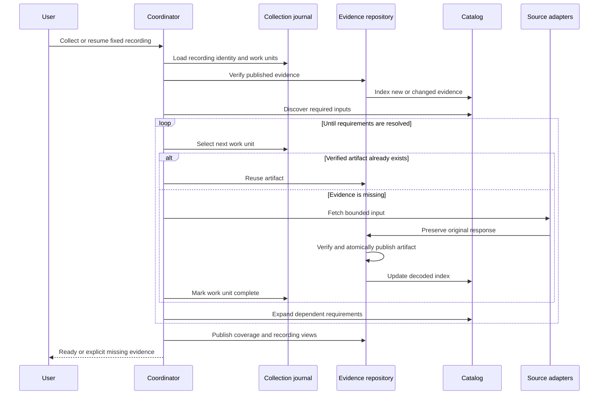
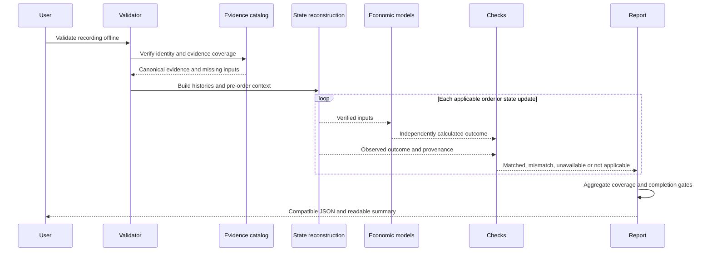

# GMX pipeline architecture

**Status:** Implemented in `src/gmx_crypto_bot_v2`; see [operations](v2-operations.md) and [regression evidence](v2-validation.md).

## 1. Goal and design decisions

Redesign the whole collection, replay, and validation pipeline around **one resumable collection command**, readable modules, and explicit evidence requirements.

Agreed direction:

- Markdown documentation with Mermaid architecture and sequence diagrams.
- Raw files remain authoritative.
- A persistent, disposable SQLite index supports discovery and validation without repeatedly decompressing evidence.
- Collection produces the inputs required by the offline validator.
- Existing economic calculations, rounding rules, recordings, and report compatibility are preserved.

This software redesign belongs to the current **3.1.1 refactor**. The existing **3.2 GMX protocol explanation** remains a separate educational task.

## 2. Current architecture and problems

The reviewed baseline is commit `2483251`. Its seven-day recording passes all 3,614 terminal orders and 61 check families.

| Finding | Consequence |
|---|---|
| One base collector plus six separate backfill entry points | Completing a recording requires manually coordinating several commands. |
| Referral, swap, and execution-trace backfills read `order-validation.json` | Collection depends on an intermediate validator result, while validation depends on collection. |
| [validator.py](../src/gmx_crypto_bot/validator.py) is 1,621 lines and combines evidence loading, reconstruction, calculations, comparisons, and reporting | Changing one responsibility requires understanding several others. |
| Accrual validation imports validator helpers, while the validator imports accrual validation | The dependency direction is circular, including deferred imports. |
| Encoding, block verification, canonical ordering, and artifact reading are distributed across modules | Similar operations have different implementations and failure behavior. |
| Restart behavior differs between collectors | The base collector requires a new directory; most snapshots reject existing output; traces support partial reuse; the impact backfill overwrites its output. |
| Large evidence files are scanned independently | The recording contains approximately 1.6 GiB of normalized events, 1.3 GiB of raw evidence, and 2.5 GiB of trace artifacts. |
| Observed replay and independently calculated state are mixed into orchestration | A careless refactor could make a check validate a value against itself. |

Current data flow:



The central correction is to move **discovery of required evidence out of the validator report**.

## 3. Implemented architecture

Keep this as a single Python application with focused internal modules. No services, workers, or external database are required.

| Component | Responsibility |
|---|---|
| **CLI and application services** | Parse commands, run collection or validation, report progress, and choose exit codes. |
| **Collection coordinator** | Order collection stages, expand discovered requirements, track completed work, and resume interrupted runs. |
| **Source adapters** | Public RPC, archive calls, HTTP observations, and transaction traces; shared retries, batching, response capture, and endpoint redaction. |
| **Evidence repository** | Preserve raw responses, verify artifact identity, publish snapshots atomically, and expose legacy recording formats. |
| **Evidence catalog and discovery** | Index decoded events and receipts; identify orders, traders, markets, tokens, configuration dependencies, and required traces. |
| **Historical state and reconstruction** | Build configuration timelines, observable state, and the context immediately before each order. |
| **Economic models** | Pure calculations for fees, funding, borrowing, impact, swaps, settlement, and execution costs. |
| **Checks and reporting** | Compare predictions with observations, determine coverage and completion, and serialize compatible reports. |

V2 data flow:



### Required boundaries

- Collection never imports validation or reads a validation report to choose collection targets.
- Economic models never access files, SQLite, RPC, or command-line arguments.
- Validators receive typed evidence and model results rather than locating files themselves.
- Observed outcomes are comparison targets. They must not seed the independent calculations being checked.
- Shared ABI encoding, storage keys, coordinates, and fixed-precision utilities live below collection and validation.
- Use immutable typed records for events, block references, order context, evidence references, and check results. Preserve raw payloads alongside normalized fields.
- Each check reports its applicability, required evidence, expected value, observed value, and discrepancy. Existing public check names and status meanings remain compatible.

### SQLite’s role and lifecycle

SQLite stores lookup indexes and decoded evidence. It does not replace raw recordings or hold the only copy of collection progress. Use Python’s built-in SQLite support.

**The index persists between commands and updates incrementally. It is not rebuilt every time the collector runs.**

| Situation | Index behavior |
|---|---|
| First run | Create the index from available evidence. |
| Resume or additional collection | Index only new or changed evidence. |
| Unchanged recording | Reuse the existing index. |
| Deleted, corrupt, or incompatible index | Rebuild from saved evidence without downloading that evidence again. |

“Disposable” means the index can be safely reconstructed, not that it is discarded after each run.

- Index by canonical coordinates, order key, transaction, market, account, event type, and artifact reference.
- Store large financial integers losslessly in payloads or decimal text; never use SQLite floating-point arithmetic for economic calculations.
- Bind the index to recording identity, source digests, and decoder/schema versions.
- Rebuild or invalidate affected entries when those inputs change.
- Deleting the index must not change validation results.

## 4. Collection and validation workflows

### One complete collector

The coordinator runs explicit stages rather than invoking existing CLI programs as subprocesses.

| Stage | Evidence produced or discovered |
|---|---|
| **Establish the recording** | Chain, market, fixed block range, confirmation boundary, and opening/closing block identities. |
| **Capture base evidence** | Opening orders and positions, contract logs, relevant headers and receipts, and timestamped HTTP observations. |
| **Discover dependencies** | Terminal orders, request updates, liquidation traders, UI receivers, swap routes, related markets, tokens, and shared inventories. |
| **Capture historical state** | Impact and fee settings, referral/pro dependencies, swap opening state, and opening/closing accrual state. |
| **Capture trace evidence** | Every required execution-fee transaction and native-payout transaction, including zero-fee liquidations when needed. |
| **Verify coverage and publish** | Verified artifacts, compatible recording views, and an evidence-readiness report identifying any missing or unsupported inputs. |

Discovery expands dependencies as new facts arrive—for example, trader → referral code → affiliate → tier. It finishes when all required dependencies are resolved or explicitly unavailable.

Full trace coverage is the default. A sample must never be reported as a complete collection. Existing gas-profile and opcode-proof restrictions remain in force.

HTTP observations retain their capture timestamps and are not used as historical block-pinned configuration.



### Resume and failure behavior

- Work units are bounded: log ranges, checkpoint pages, archive batches, or individual transaction traces.
- Progress is recorded in a durable collection journal separate from SQLite.
- Mark a work unit complete only after its evidence has been persisted and verified.
- On restart, verify completed units and fetch only missing work.
- Interrupted writes remain unpublished; they cannot appear as complete evidence.
- Reorgs, changed recording identity, conflicting artifacts, and corrupt evidence stop dependent stages.
- Use one writer per recording.
- Existing recordings can be adopted and enriched without rewriting their original evidence.

### Offline validation

The validator builds one shared evidence context and runs an explicit dependency-ordered set of checks. Observable replay and independent model state remain separate consumers of the same verified inputs.



### Public commands

Preserve the existing command names:

```text
gmx-collect --spec <spec> --output <recording>
gmx-collect --spec <spec> --output <recording> --resume
gmx-replay <recording> --verify
gmx-validate <recording> --output <report>
```

Collection success means **the required evidence is available**. Validation success means **the applicable economic checks pass**. These remain distinct outcomes.

Collection stages run through the unified collector. Progress output includes stage, completed/total work, reused artifacts, retries, and missing evidence.

## 5. Refactoring sequence and acceptance criteria

The implementation follows this sequence:

1. Freeze the current reports, replay digest, and supported behaviors as the regression baseline.
2. Extract shared primitives and evidence access; remove imports back into validator orchestration.
3. Introduce the disposable catalog and report-independent discovery.
4. Consolidate source access, collection stages, and resumable coordination.
5. Separate state reconstruction, economic calculations, checks, and report serialization.
6. Keep the three module CLI entry points and update operating documentation.

Acceptance requires:

- All **116 existing tests** pass.
- The seven-day recording retains **3,614 matched orders**, zero mismatches/decode errors, **103 liquidation matches**, **3,511 execution-fee proofs**, and no open economic checks.
- Existing check outcomes, calculated values, tolerances, and replay digest remain unchanged.
- Fresh collection works without an existing validation report.
- Resume tests cover interruption during log capture, snapshots, traces, and artifact publication.
- Missing/corrupt evidence, reorgs, conflicting snapshots, duplicate payments, and unsupported cases cannot produce a false pass.
- Rebuilding or deleting SQLite produces identical validation results.
- Offline replay and validation make no network calls.
- A warm indexed run avoids repeated decompression and decoding of unchanged raw bundles; measure runtime and peak memory against the current implementation.
- Import-boundary tests enforce the architecture.

## 6. Module map

| Layer | V2 modules |
|---|---|
| CLI/application | `application/collection.py`, `application/validation.py`, `application/replay.py` |
| Collection | `collection/coordinator.py`, `collection/journal.py`, base capture and five historical stages, `collection/traces.py` |
| Source adapters | `sources/rpc.py`, `sources/http.py`, `sources/resumable.py` |
| Evidence | `evidence/catalog.py`, `repository.py`, `discovery.py`, `publication.py`, `traces.py`, `snapshots.py` |
| Shared primitives | `domain/events.py`, `keys.py`, `swap_keys.py`, `accrual.py`, `payments.py`, `evidence.py` |
| Reconstruction | `reconstruction/orders.py`, `positions.py`, `context.py`, configuration/referral/swap/accrual histories, `observed.py` |
| Pure models | `models/impact.py`, `accrual.py`, `swaps.py`, `referral.py`, `decrease.py`, `settlement.py`, `execution.py`, `prb.py` |
| Checks/reporting | `checks/orders.py`, position/fee/swap/accrual/liquidation checks, `checks/trace.py`, `reporting/orders.py` |

Top-level V2 modules provide only the three module CLI entry points. They do not import the
V1 implementation. The pure models and shared primitives contain no filesystem,
network, SQLite, or CLI access. Order checks receive `OrderContext` and
`ValidationContext`; trace checks receive parsed trace evidence through a typed
source interface.

Collection uses compressed, atomic RPC work units for log ranges, checkpoint and
archive batches, and traces. An interrupted base stage reconstructs its unpublished
normalized view from these saved responses; successful bounded source requests
are reused. A completed base view is published file by file, with its completeness
report last and its journal entry after publication. This keeps legacy recording
paths intact while allowing interrupted publication to resume.

The catalog stores acquisition and canonical coordinates, decoded values, source
paths, and source digests. A changed normalized file is reindexed as one source;
unchanged raw bundles are not decompressed. Corruption/incompatibility rebuilds
the disposable projection. Collection progress remains in the journal. Exact RPC responses and transaction
traces are durable evidence in separate SQLite stores; the catalog is only a
rebuildable projection.

### RPC response storage

Successful RPC responses are stored in `.collection/rpc/requests.sqlite`, keyed
by source role and request hash. This persistent resume store is separate from
the rebuildable `.gmx-v2/catalog.sqlite`. Responses retain their original request,
compressed exact body, and SHA-256 checksum. Raw evidence bundles remain available
for replay and auditing. Existing per-request `.json.gz` files are migrated on
resume: each response is committed and read back before its old file is removed.
Empty legacy role directories are removed. Migration can safely resume after an
interruption; invalid files are preserved and reported as errors.
