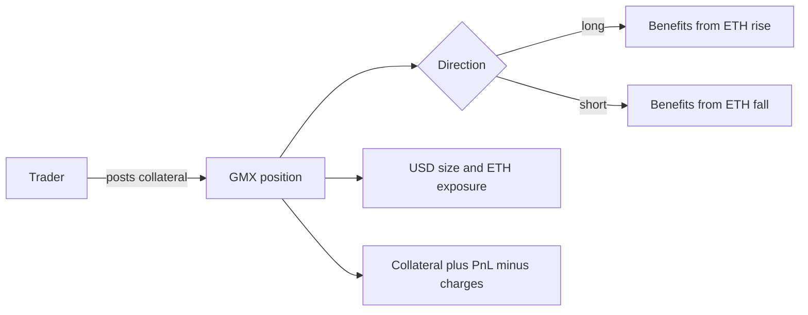

# Lesson 1 — Positions and exposure

**Goal:** Given a side, collateral, size, and price move, explain the position's directional exposure and approximate profit or loss. Read the [course guide](README.md) first.

## 1. A perpetual is a position, not a dated purchase

A spot ETH purchase transfers ETH to you. A GMX perpetual position instead records a **long** or **short** exposure to ETH's price. It has no scheduled expiry. It can stay open while its collateral covers losses and required margin, but financing charges can accumulate. The market's index token is WETH. In this course's ETH/USD [WETH-USDC] market, the pool's long token is WETH and its short token is USDC. A trader can post an eligible collateral token and choose either direction. The token posted as collateral is distinct from the direction of the perpetual position. [GMX positions and order types](https://docs.gmx.io/docs/trading/order-types/) describes this linear, multi-collateral model.

A long benefits when ETH rises; a short benefits when ETH falls. The position records USD size and token size. The token size captures price sensitivity. At an entry price of $2,500, a $10,000 position corresponds to roughly 4 ETH of exposure. A $100 move then changes pre-fee PnL by roughly $400: positive for a long if ETH rises, positive for a short if ETH falls. This is **not** a promise about take-home proceeds. Fees, price impact, the oracle spread, and possible collateral-token movement still matter.

## 2. Size and collateral answer different questions

**Size** describes the market exposure. **Collateral** is the asset backing potential losses and charges. Approximate entry leverage is `position size in USD / collateral value in USD`. A $10,000 size backed by $1,000 of USDC starts near 10× leverage, before entry charges. It does **not** mean the trader bought $10,000 of ETH with a $1,000 cash payment. It means a 1% adverse ETH move can change the position's value by about $100, or about 10% of the initial $1,000 collateral, before charges. Leverage rises if collateral is consumed by a loss or fees, even if USD size is unchanged.

Take a long opened at $2,500 with $10,000 size and $1,000 USDC collateral. The implied token exposure is about 4 ETH. At $2,600, pre-fee PnL is about `4 × ($2,600 − $2,500) = $400`. At $2,400, it is about −$400. A short of the same size reverses those signs. The $1,000 collateral is not the notional and does not set the PnL slope. It determines how much adverse movement the position can absorb before it breaches risk rules.

| Term | Plain meaning | Example |
|---|---|---|
| Index token | Asset whose price drives PnL | ETH/WETH |
| Side | Sign of price exposure | Long or short |
| Size in USD | Notional exposure | $10,000 |
| Size in tokens | Approximate price sensitivity | 4 ETH at $2,500 |
| Collateral | Asset supporting the position | $1,000 USDC |
| Equity | Value left after PnL and charges | Changes over time |

## 3. Collateral can introduce another exposure

With USDC collateral, a long or short is comparatively easy to reason about in USD: the collateral's USD value is intended to be stable, though it is still valued by an oracle. With WETH collateral, the collateral itself moves with ETH. A WETH-backed short can therefore have a short perpetual exposure and a long collateral exposure at the same time. These can offset in some price ranges, but they are not automatically a risk-free hedge. Fee accrual, liquidation rules, differing sizes, and collateral price movement can break a simple cancellation. [GMX positions and order types](https://docs.gmx.io/docs/trading/order-types/) gives examples of these collateral combinations.

For this recording, the market specification uses **native USDC** as collateral in the teaching examples. This is the ERC-20 at `0xaf88...5831`, not bridged USDC.e. Six decimals mean `308883390` raw units are 308.883390 USDC. GMX USD amounts use high-precision integers; this course renders them as human-readable USD only when the scale is known. The recording's `sizeDeltaUsd` is therefore a different unit from `initialCollateralDeltaAmount`.

## 4. From a position to a lifecycle

A trader first creates an order request. A keeper later executes it if the conditions are met. Opening, increasing, decreasing, and closing a position are separate requests. A close can release collateral and realize PnL; while the position remains open, its PnL is unrealized. A decrease can realize only part of it. A collateral deposit or withdrawal can change leverage without changing the position's USD size. If risk rules are breached, liquidation is a separate terminal action. [GMX order types](https://docs.gmx.io/docs/trading/order-types/) describes these actions.

For a simulator, the crucial state is not merely “long” or “short.” It needs side, size in USD and tokens, collateral amount and token, entry state, accumulated fees, and the market's current configuration. A replay can tell us what happened; a hypothetical strategy must additionally calculate what *would have happened* for a proposed order at a later keeper/oracle state.

## Questions — answer without an answer key

1. In one sentence each, distinguish a spot ETH purchase from a GMX ETH long perpetual.
2. A $12,000 ETH long is opened at $3,000. About how many ETH of price exposure does it have, and what is its approximate pre-fee PnL if ETH rises to $3,150?
3. Repeat question 2 for a short. State the sign of PnL.
4. A $12,000 position has $1,500 USDC collateral. What is its approximate entry leverage, and which of those two numbers controls the pre-fee PnL slope?
5. Why can leverage increase while the recorded USD position size stays unchanged?
6. What extra ETH price exposure exists when a short uses WETH collateral instead of USDC collateral?
7. In the recording, why must `initialCollateralDeltaAmount=308883390` not be read as 308,883,390 USD?
8. Name at least four position fields a strategy simulator needs in addition to the side.
