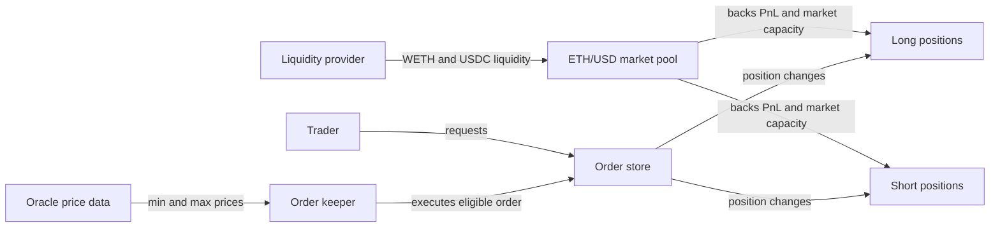

# Lesson 2 — The market, pool, and open interest

**Goal:** Explain what backs the positions, how traders and liquidity providers interact, and why long/short imbalance changes costs. [Course guide](README.md).

## 1. One market, several roles

The target market is ETH/USD [WETH-USDC] on Arbitrum. ETH/WETH is the index exposure; WETH and USDC are the pool's two assets. Traders create long or short positions, liquidity providers deposit pool assets and own market tokens, and keepers execute eligible requests using oracle data. Traders do not need an orderbook counterparty waiting on the opposite side of their exact order. The pool stands behind position PnL, subject to market capacity and risk limits. When traders collectively profit, that value comes out of the pool's available value; when they lose, the pool benefits before other accounting effects. Fees and funding distribute value among traders, pool, and fee receivers under the market's rules. [GMX Synthetics README](https://github.com/gmx-io/gmx-synthetics/blob/main/README.md) and [GMX trading overview](https://docs.gmx.io/docs/trading/) describe these roles.

The pool is not a vault that holds a fixed number of opposite trader contracts. A short can be opened when there is no matching long order in the same block. That is why we track **pool liquidity**, **open interest**, and **available capacity** separately. LPs face exposure to trader PnL and inventory imbalance, not simply a conventional “exchange fee” income stream.

## 2. What open interest measures

Open interest (OI) is the aggregate open position size on a side. Suppose long OI is $60 million and short OI is $40 million. The net long/short imbalance is $20 million; total gross OI is $100 million. Gross OI tells us how much exposure exists, while imbalance tells us which side dominates. Both matter. “Equal long and short OI” does not mean the pool has no risk or no capital usage: each side still reserves capacity and can generate payments or losses as prices and positions change.

The recorded `PositionIncrease` and `PositionDecrease` events change OI. The V2 replay stores OI history and the validation checks that observed updates are consistent with position events. In the long example used in Lesson 5, the event contains `pre_open_interest_tokens.long` and `.short`; these are **token quantities**, not directly the USD OI figures used in every fee formula. Historical configuration and an oracle price are needed to interpret the risk state at the relevant block. That prevents treating a current UI rate as if it applied to a past order.

## 3. Imbalance changes costs and incentives

GMX uses position fees, funding, and price impact to influence the balance between sides. An order that increases absolute long/short imbalance can have a higher position fee and negative price impact. An order that reduces imbalance can have a lower position fee or positive price impact. The exact result depends on historical market configuration, the order's size, and the relevant before/after state. The general **funding** idea is that the crowded side pays the other side, encouraging traders to move against the imbalance. **Borrowing** is a separate charge for reserving pool capacity; it is not the same as funding and is configuration-dependent. [GMX fees](https://docs.gmx.io/docs/trading/fees/) explains the current rules; the recording's configuration determines its historical checks.

A useful mental model is to separate three questions:

| Question | State to inspect | Why it matters |
|---|---|---|
| Can the market support more exposure? | Pool value, reserve and max-OI settings | Capacity and liquidation safety |
| Which direction is crowded? | Long and short OI | Funding, position-fee tier, impact |
| What will the order actually pay? | Historical factors and exact pre-order state | A trade-sized cost, not a UI snapshot |

An illustrative $1 million long added to $60 million long OI and $40 million short OI increases imbalance to $21 million. A $1 million short decreases it to $19 million. This does **not** imply every short is profitable: its price risk may be much larger than any balancing credit. Likewise, a positive price-impact credit does not guarantee that the order will pass its acceptable-price condition or avoid financing costs later.

## 4. Why swaps and collateral matter

The market's long and short assets can also be exchanged through GMX swap paths. A trader may pay an initial token that needs to be swapped into the chosen collateral token, and a decrease may swap the output token. A swap path adds its own liquidity and price-impact considerations. The target examples in Lesson 5 start with USDC and retain USDC collateral, which keeps the first walkthrough focused on the perpetual position. Other recorded orders use different paths; the validator reconstructs those separately.

Pool composition matters even when the target trade is a USDC-collateral ETH short. The market needs adequate WETH and USDC to manage payouts and positions. A description such as “the trader shorted against a long trader” hides the pool's actual role. A more useful statement is: the trader holds a short position whose PnL is settled through a market backed by LP deposits, within configured capacity and pricing rules.

## Questions — answer without an answer key

1. Identify the index token, long pool token, and short pool token for ETH/USD [WETH-USDC].
    -> long pool token is WETH, short pool token is USDC, index token is ETH
2. Does every GMX short require a simultaneous matching long order? Explain who backs the position.
    -> No it does not. GMX liquidity pool backs the position 
3. If long OI is $60 million and short OI is $40 million, what are gross OI and absolute imbalance?
    -> Gross OI is $100 mln, and absolute imbalance is $20 mln
4. In that state, what happens to the absolute imbalance after a $1 million long increase? After a $1 million short increase?
    -> after a $1 mln long increase the imbalance will increase to $21 mln. after the $1 mln short increase the imbalance will $19 mln
5. Why can equal long and short OI still consume pool capacity?
    -> because the pool has the obligation to pay traders. The traders are not trade against each other. The pool is counter party for both sides. And the pool has to pay traders.
6. Name two mechanisms that can make a trade that worsens imbalance costlier than a trade that improves it.
    -> GMX uses position fees, funding, and price impact to influence the balance between sides. An order that increase absolute long/short imbalance can have a higher position fee and negative price impact.
7. Why is a current GMX UI fee or funding rate insufficient to validate an order executed at a historical block?
    -> Historical configuration and an oracle price are needed to interpret the risk state at the relevant block.
8. Explain why a trader's initial collateral token and the market's index token are separate concepts.
    -> Index token is a token whose price will be tracked in the leveraged position, i.e. ETH . Initial collaterial token is a token that will be used as a deposit for collaterial in the position
