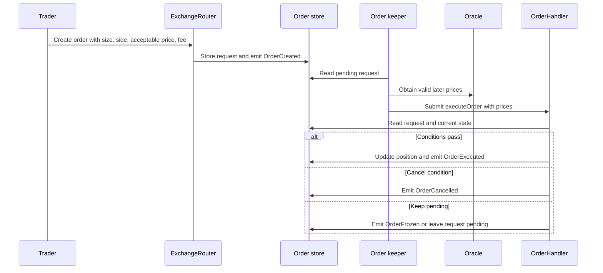

# Lesson 3 — From request to execution

**Goal:** Trace an order from an on-chain request to an execution, cancellation, or freeze, and explain why the eventual price can differ from the price visible at request time. [Course guide](README.md).

## 1. A request is not a fill

On GMX V2, a trader creates an **order request** through the router. The request records a unique order key, account, market, side, order type, size delta, collateral fields, receiver, acceptable price, and an execution-fee budget. The request is observable on-chain as `OrderCreated`. It does not immediately change the position's size. An order keeper later identifies eligible requests and submits a transaction with suitable signed oracle prices. The order handler then runs the contract checks and emits a terminal outcome. [GMX Synthetics README](https://github.com/gmx-io/gmx-synthetics/blob/main/README.md) describes this request/keeper flow.

The diagram is conceptual: particular contract paths have their own revert, cancel, and freeze rules. The safe analytical distinction is **request created**, **terminal event observed**, or **still pending at the recording boundary**. A request without a terminal event in a seven-day recording is not automatically a failed trade or missing data; it may execute after the window. The V2 validator calls such cases unresolved.

## 2. Oracle min/max prices and acceptable price

GMX uses oracle prices rather than a central limit orderbook. A signed price report may include a lower `minPrice` and upper `maxPrice`. For core position pricing, opening a long uses the upper price, opening a short uses the lower price, closing a long uses the lower price, and closing a short uses the upper price. This is economically conservative for the trader. The chart's midpoint is not the fill price. A trigger price determines when a conditional request becomes eligible; an **acceptable price** is a separate limit on the eventual execution price. Oracle gaps can move an eligible order past its trigger. [GMX positions and order types](https://docs.gmx.io/docs/trading/order-types/) explains these price conventions.

| Position action | Relevant oracle side | Intuition |
|---|---|---|
| Open long | max | Pay a higher entry price |
| Close long | min | Receive a lower exit price |
| Open short | min | Sell at a lower entry price |
| Close short | max | Buy back at a higher exit price |

A simplified long market increase might be requested while ETH is near $2,500, with an acceptable price of $2,525. If the keeper attempts execution when the applicable price is $2,530, the acceptable-price constraint can prevent the desired fill. Whether the request cancels, freezes, or remains pending depends on order type and contract rules; do not infer a terminal reason from the price alone. The historical validator checks the recorded request and terminal outcome, including the actual reason evidence where available.

## 3. Market, limit, and stop behavior

A **market increase/decrease** asks the keeper to execute when a valid later oracle price is available, subject to contract checks and acceptable price. It is asynchronous, not an immediate orderbook market fill. A **limit increase** opens only when a favorable trigger condition is reached; a **limit decrease** can take profit. A **stop-market** request can become eligible when price moves adversely, but execution can occur at a worse later oracle price, or a liquidation can happen first. There is no guarantee that seeing a chart touch the trigger produces a fill. GMX's [order-type documentation](https://docs.gmx.io/docs/trading/order-types/) gives the current trigger directions and caveats.

Orders can also be updated or cancelled. For replay, the original `OrderCreated` must be joined to `OrderUpdated` events and the final request state before terminal execution. A key identifies the order, while block number, transaction index, and log index determine exact event order. If two events share a block, block number alone is not enough to reconstruct the pre-execution state. The collector preserves both decoded events and raw RPC evidence; replay sorts canonical events and validates a deterministic state digest. See [V2 operations](../v2-operations.md) for the local pipeline.

## 4. Why delay is a first-order input

There are at least two separate transactions: request creation and keeper execution. Delay can be measured in blocks, seconds, or oracle updates. Those are different units. During the delay, ETH price, min/max spread, OI, fee configuration, funding, borrowing, and liquidation risk can change. A strategy that assumes execution at the request block will misstate slippage, fees, and exposure timing. The simulator planned after this course must submit a hypothetical request at a recorded state and make it effective only at a later recorded keeper/oracle state.

The recording can prove an execution occurred through the terminal event and transaction receipt. It cannot tell us the trader's private intent beyond recorded parameters. Nor does a replay's deterministic digest prove that every economic check passed: replay verifies state reconstruction, while validation compares independent expected values with observed outcomes.

## Questions — answer without an answer key

1. What changes on-chain at `OrderCreated`, and what position change has **not** happened yet?
    -> The GMX creates a record in the OrderStore. It records a unique order key, account, market, side, order type, size delta, collateral fields, receiver, acceptable price, and an execution-fee budget. It does not create a position yet. Order Keeper creates an order later.
2. Put these in order: `OrderExecuted`, signed oracle price supplied, `OrderCreated`, keeper finds request.
    -> OrderCreated ->  keeper finds request -> signed oracle price supplied -> `OrderExecuted`
3. Which oracle bound is used for an open long, close long, open short, and close short?
    -> Open long: max oracle side, Close long: min oracle side, Open short: min oracle side, Close short: max oracle side. 
4. Explain the difference between a trigger price and an acceptable price.
    ->  A trigger price when GMX allowed to try to execute an order; an acceptable price is the price trader can accept to execute an order.
5. Why can a stop-market order fail to protect a position from liquidation?
    -> price can jump past the tresholds. 
6. Why can an order be unresolved at the seven-day boundary without indicating a data gap?
    -> because oracle won't be providing the suitable price for a position to execute.
7. Why does canonical replay order need transaction and log indexes in addition to block number?
    -> because several transactions can sit in one block. log index is needed to determine the order of transactions in one block.
8. Name three pieces of state that can change between request creation and keeper execution and alter the eventual economics.
    -> ETH price, min/max spread, OI, etc.
