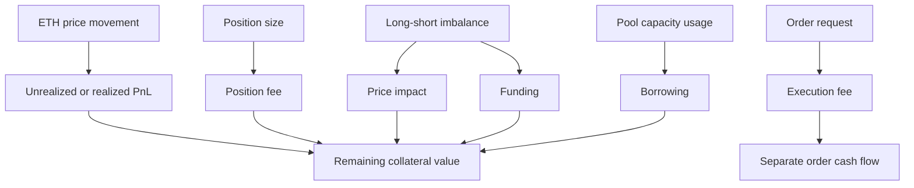
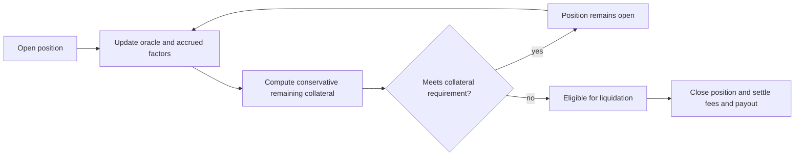

# Lesson 4 — Fees, impact, funding, borrowing, and liquidation

**Goal:** Explain how a position's equity changes beyond the ETH price move, and why a liquidation price moves over time. [Course guide](README.md).

## 1. Keep distinct costs distinct

A trader's price PnL is only one line of the account. The following categories answer different questions. A **position fee** is charged on trade size when opening, increasing, decreasing, or closing. **Price impact** reflects how the trade changes the market's long/short imbalance. **Funding** transfers value between sides over time. **Borrowing** charges for using pool capacity. The **execution fee** pays for keeper/network execution and is funded from the order request; it is not a position fee or a funding payment. A **liquidation fee** can apply if the position is liquidated. Swaps, UI fees, referrals, and payout conversions can add more lines. Current [GMX fees documentation](https://docs.gmx.io/docs/trading/fees/) explains these categories; historical rates are read from the recording's configuration.

An approximate teaching equation is `position equity ≈ collateral value + unrealized PnL − unpaid position-related charges ± applicable impact`. It is a conceptual reconciliation, not the exact contract formula or proof of liquidatability. Exact behavior depends on collateral token, accrued state, historical factors, caps, rounding, and operation type. Keep the execution-fee cash flow visible separately so it is not confused with a change to position collateral.

## 2. Price impact is not a generic swap slippage number

When a trade changes OI imbalance, GMX calculates price impact with configurable factors and exponents, plus caps. Improving balance can create positive impact; worsening it can create negative impact. In the September 2026 recording, `PositionIncrease` events can contain both an `executionPrice` adjusted by impact and `pendingPriceImpactUsd` stored for later settlement. This is why the lesson never assumes a single naive rule such as “all impact is fully paid at entry.” Current [GMX fees documentation](https://docs.gmx.io/docs/trading/fees/) describes a net-impact mechanism in which impact is stored at entry and applied on decrease. The historical example in Lesson 5 must be read using its emitted fields and block-specific configuration.

A trade that reduces imbalance is not necessarily cheaper overall. Its position fee may be lower and its price impact favorable, but it can still pay a keeper fee, accrued borrowing, and market risk. A careful comparison names the exact order size, pre-order OI, historical factors, oracle prices, and fees. The V2 validator independently rebuilds fee and impact factors from historical snapshots rather than trusting the event as its own expected value.

## 3. Funding and borrowing accrue with time

Funding is a side-to-side incentive related to imbalance. The current rate can adjust over time; “longs are crowded now” does not by itself determine the sign and magnitude of every historical funding payment. Borrowing addresses pool-capacity usage. These charges can accrue while the position sits unchanged. When an order later modifies or closes it, accrued amounts are brought into the settlement. [GMX fees](https://docs.gmx.io/docs/trading/fees/) describes the current rate mechanisms and cumulative factors.

For an illustration, imagine a $10,000 long with $1,000 collateral and no ETH price movement. If accumulated position-related charges total $40, equity is lower even though PnL from ETH is zero. Approximate leverage rises from 10× to `10,000 / 960 ≈ 10.42×`. Less adverse ETH movement is now needed to exhaust the remaining buffer. The example isolates the direction of the effect; actual liquidation checks include additional conditions.

## 4. Liquidation tests remaining collateral, not just a fixed price

Liquidation is possible when remaining collateral, after unrealized losses, accrued fees, and capped negative impact, falls below the market's minimum collateral requirement. GMX uses the unfavorable oracle bound for PnL: min price for a long and max price for a short. The collateral token is valued conservatively too. The applicable threshold and liquidation fee are market-configured. Crucially, the liquidation fee is charged when the liquidation executes, while the liquidatability check has its own rules. The liquidation price therefore moves as funding, borrowing, collateral value, and market configuration change. [GMX liquidations](https://docs.gmx.io/docs/trading/liquidations/) explains these distinctions.

A stop-loss is an order request, not a liquidation shield. If a keeper has not executed it by the time the position becomes liquidatable, liquidation can come first. The recording's 103 liquidations were checked by the validator using historical state. That validates the observed window, not every hypothetical future trade. A future simulator must recalculate the buffer after each state change.

## Questions — answer without an answer key

1. Distinguish position fee, execution fee, funding, and borrowing in one clause each.
2. If ETH price is unchanged but borrowing and funding charges accumulate, what happens to position equity and approximate leverage?
3. What market state makes a trade eligible for positive rather than negative price impact, in general terms?
4. Why can a favorable impact credit fail to make a trade profitable?
5. Why is `pendingPriceImpactUsd` important when reading a recorded increase?
6. Which oracle bound is conservative for a long's liquidation PnL? Which for a short's?
7. Name three reasons a liquidation price can move while position size stays unchanged.
8. Why must a validator use historical configuration and pre-order state rather than the event's fee amount as both expected and observed value?
