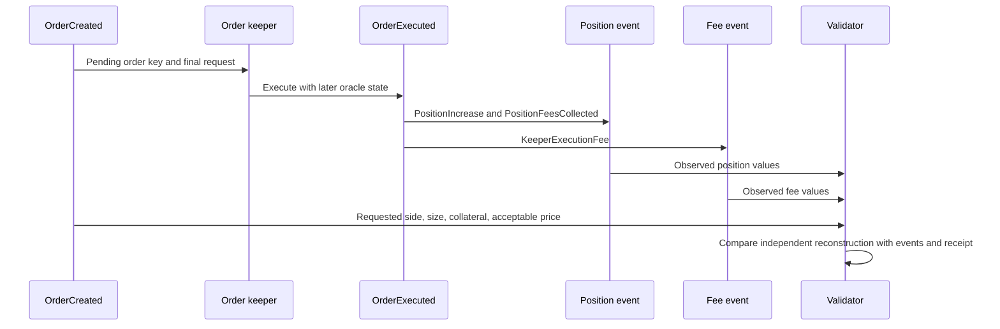

# Lesson 5 — Follow one recorded long and one recorded short

**Goal:** Read a concrete request, terminal event, position event, fee event, and receipt check as one historical story. [Course guide](README.md).

## 1. The evidence chain

The examples come from the V2 [order-validation report](../../recordings/eth-usdc-v2-sep-20-sep-27/order-validation.json). Both are market-increase orders (`orderType=2`) with native USDC collateral in the pinned ETH/USD [WETH-USDC] market. The values below are display conversions from recorded integers: USDC has six decimals, execution fee is in ETH at 18 decimals, USD size and impact use 30 decimals, and the WETH oracle/execution price fields shown here use 12 decimals. The report is the convenient index; the underlying `events.jsonl`, raw RPC bundles, and SQLite trace evidence preserve the source observations. [V2 operations](../v2-operations.md) explains the recording layout.

This sequence is conceptual. Within the terminal transaction, the fee and position events may have log indexes before the final `OrderExecuted` event. The **order key** joins them logically; canonical chain coordinates give their actual order. Do not read the arrows as literal log order.

## 2. A recorded USDC-collateral long

The long order key is `0x67a2dac4cde23559c64fd6637bbbc42d93fb852cdb9c429d8524f2f66e9d694c`. Its `OrderCreated` appears in block **508316103**, transaction `0x36b8c3e6634bbc26f840f23c03e4e58fc7a5f45a0887b3ecc01956af4d200657`. The request says `isLong=true`, about **$8,203.90** of size, **308.883390 USDC** initial collateral, acceptable price about **$2,715.486**, and **0.000108165086172 ETH** execution-fee budget. The raw integer fields remain in the report if exact rounding matters.

The keeper's terminal transaction is `0x7941a4f3e68af1dd0943a14908edac73ab62b19eaa357c9a3c54c0d885a73141` in block **508316116**, **13 blocks** after creation. It emits `PositionFeesCollected`, `PositionIncrease`, `KeeperExecutionFee`, and `OrderExecuted`. The `PositionIncrease` records about **$8,203.90** new size, **303.960475 USDC** collateral after the position fee, **$2,689.225** execution price, and a WETH oracle value of about **$2,688.684**. `PositionFeesCollected.positionFeeAmount` is **4.922915 USDC**. The difference between initial collateral and recorded collateral is exactly that amount for this simple no-swap opening. The recorded `pendingPriceImpactUsd` is about **−$1.652**, so the price-impact story cannot be inferred from the oracle price alone. The keeper-fee event reports **0.000108165086172 ETH**.

The report marks `receipt`, `gas_used`, `acceptable_price`, `execution_price`, `position_fee`, and `execution_fee_gas_and_transfer_proof` as `matched` for this order. “Matched” means the V2 validator's corresponding check reconciled its evidence and expected value. It does not mean the trader made money: this is an opening, not a completed round trip. The account and position key are available in the event records, but the order key and transaction hashes are enough to locate this case.

| Stage | Long evidence | What it tells us |
|---|---|---|
| Request | `OrderCreated`, block 508316103 | Trader intent and reserved fee |
| Later oracle/keeper | Terminal block 508316116 | The market state used to execute |
| Position | `PositionIncrease` | Actual size, collateral, price, stored impact |
| Fees | `PositionFeesCollected`, `KeeperExecutionFee` | Position charge versus separate keeper charge |
| Receipt and checks | `receipt=matched`, `gas_used=matched` | Transaction identity and execution proof |

## 3. A recorded USDC-collateral short

The short order key is `0xe1b95793bdfa6b426787e5e60450076ac6487f6baf38f737f7b80cc90b63df47`. Its `OrderCreated` is in block **508322416**, transaction `0x3b7dda7d854a348ba556253dd2c234533b2587bd46c7c13ed0c9baddd980f09f`. It says `isLong=false`, about **$43,170.53** size, **2,995.000000 USDC** initial collateral, acceptable price about **$2,647.246**, and **0.0001073821361184 ETH** execution-fee budget. A short's profitable direction is an ETH fall, independent of its USDC collateral token.

The keeper's terminal transaction is `0x15032ba1afa7ec91dac352e3cc5c065cf7a8903e6212091922d76aa83d5062f0` in block **508322428**, **12 blocks** after creation. The `PositionIncrease` records about **$43,170.53** size, **2,977.729915 USDC** collateral after a **17.270085 USDC** position fee, execution price about **$2,674.483**, and oracle price about **$2,674.072**. The event also records about **+$6.621** `pendingPriceImpactUsd`. The short opening improved balance under the recorded factor state; a higher execution price is favorable to a short. As with the long, read the stored impact and the adjusted execution price as separate recorded facts. The `KeeperExecutionFee` event records **0.0001073821361184 ETH**.

The same receipt, gas, acceptable-price, execution-price, position-fee, and execution-fee proof checks are `matched`. The short's acceptable-price condition and favorable impact are different concepts. A short entry at a favorable price still bears the risk of ETH rising after execution. The example does not show a final PnL or a liquidation; those require following this position's later events and accruals.

## 4. How to investigate an order yourself

Open `order-validation.json` and search for either key. Compare `request.values` with `final_request` in case an order was updated. Then read `terminal`, `observed_execution_events`, `observed_execution_fee_events`, and `checks`. For exact chronology, inspect the events' `block_number`, `transaction_index`, and `log_index`. For independently recomputed results, examine the report's modeled fields and check outcomes. The raw recording and captured receipts support the report; the report is not the chain itself.

When interpreting any number, ask four questions: **Which asset/unit? Which side? At which block? Observed or modeled?** Confusing a USDC integer with a USD integer, a request price with the later oracle, or an observed fee with an independently reconstructed fee can make a false explanation look plausible. The lesson's two orders illustrate a valid join; they are not representative estimates of average fees or execution delay for all 2,942 terminal orders.

## Questions — answer without an answer key

1. Give the long order key and its request and terminal block numbers. How many blocks separate them?
2. For the long, compute the difference between requested initial USDC collateral and the collateral recorded in `PositionIncrease`. Which event field explains it?
3. Give the short order key and identify its side, collateral token, and approximate USD size.
4. For the short, compute the difference between initial and recorded USDC collateral. Which recorded fee amount does it match?
5. Why must the ETH execution fee be kept separate from the USDC position fee in both examples?
6. Why does `OrderExecuted` plus `PositionIncrease` show an opening but not the position's final trading profit?
7. The short's execution price is above its oracle price and `pendingPriceImpactUsd` is positive. Why is a higher entry price favorable for a short, and why must stored impact still be tracked separately?
8. If you wanted to verify a fee value without circular reasoning, which historical inputs and which observed output would you compare?
