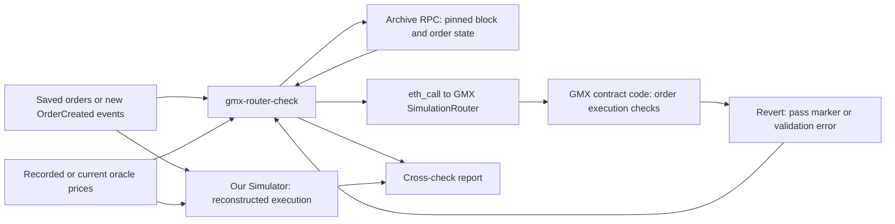

# Step 4.1 plan: Cross-check reconstructed execution

Status: Proposed. Implementation and evidence collection have not started.

## Purpose

Use GMX's `SimulationRouter.simulateExecuteLatestOrder` through a read-only `eth_call` to check whether an existing public order passes GMX's execution validation with a specified oracle price set. Compare that result with our reconstructed execution eligibility and errors. GMX signals a passed preflight by reverting with `EndOfOracleSimulation`; other reverts can identify validation failures. The call makes no chain changes. This check does not calculate a complete position lifecycle, fees, or PnL, and a passed preflight does not guarantee later keeper execution. See the [GMX simulation documentation](https://docs.gmx.io/docs/api/contracts/simulations/).

**GMX execution validation** is the set of contract checks that GMX runs when it tries to execute an existing order. The checks depend on the order type and chain state. They can include whether oracle prices are valid for the order, whether a limit or trigger price is reached, whether the execution price meets the user's acceptable price, and whether the position has enough collateral. A failed check can stop or freeze execution. See GMX's [order documentation](https://github.com/gmx-io/gmx-synthetics) and [contract errors](https://github.com/gmx-io/gmx-synthetics/blob/main/contracts/error/Errors.sol).

Step 4.1 asks GMX's `SimulationRouter` to run those checks for an existing order with specified prices. `EndOfOracleSimulation` means that the preflight passed. Another revert can identify a validation error. This result helps us check whether our Simulator's execution decision agrees with GMX for the same state and prices. It does not verify our fee, PnL, or full lifecycle calculations.

## Architecture: who simulates what



The **Simulator** uses saved order and market data to reconstruct what could happen to a position. It calculates its own execution result and risk values. It does not run GMX contract code.

The **`gmx-router-check` command** selects an existing GMX order. It checks that the order is pending and is the latest global request at the selected block. It sends the order's price inputs to GMX through `eth_call`.

The **GMX `SimulationRouter`** runs GMX's contract checks against the state at that block. It simulates whether that order can pass execution validation with those prices. The call always reverts. `EndOfOracleSimulation` means that the preflight passed; a different revert can show a validation error. The call does not change chain state.

The **cross-check report** puts the GMX preflight result beside the Simulator result. It states if the two results used equivalent state. A GMX pass checks execution eligibility only. It does not check the Simulator's fees, PnL, or full position lifecycle.

## Order source and comparison gate

Start with `OrderCreated` events in `recordings/eth-usdc-v2-sep-20-sep-27`. Each event gives a 32-byte **order key**, not a sequential order number. Keep its block, transaction index, and log index so that the event and its state can be found again. Match the key to later order events in the recording. If this recording has too few suitable cases, collect a bounded set of new public `OrderCreated` events and their required evidence.

Apply two gates to each candidate:

1. **GMX call gate:** At the pinned block, verify that the order is pending and its key is the latest global request key. The router's latest-order function cannot take an arbitrary key. Skip the call if this proof fails.
2. **Our reconstruction gate:** Verify that the same order's request fields, oracle prices, market configuration, and pre-execution state are available to reconstruct its execution decision. Use the observed-order validation path and the Simulator's economics and evidence components for this check. The scenario runner models hypothetical orders; a recorded order does not become a scenario order without an explicit adapter or test case.

Only compare GMX and our reconstruction when **both** gates pass and both checks use equivalent state and prices. Record a GMX-only result as preflight evidence. Do not claim agreement with the Simulator when the reconstruction gate fails. If the available block state cannot represent the order's actual pre-execution state, label the result preflight only.

An order in the September recording does **not** need to be pending today. For a historical `eth_call`, it must have been pending and the latest global request at the pinned historical block. An archive provider must supply the state for that block.

### One-day backup recording

If the September recording has too few candidates that pass both gates, collect only the latest rolling 24 hours in a new directory:

```bash
gmx-collect \
  --spec gmx-market-spec-v1.json \
  --last-days 1 \
  --output recordings/eth-usdc-oct-6-day
```

This range ends at the provider head minus the confirmation depth, which is 64 blocks by default. It reduces the history to collect. It does not guarantee that any order is still pending and latest at the current head. Apply the same two gates to its orders. If both recordings lack suitable cases, use the bounded live watcher to inspect new public requests near creation time. The watcher must capture enough evidence for our reconstruction before it can claim a comparison.

## Approach

1. Add a read-only `gmx-router-check` command with historical and bounded watch modes. Neither mode creates an order, signs, or sends a transaction.
2. Start with saved recordings. Scan candidates in coordinate order for long and short increases and decreases. Read their order keys from `OrderCreated` events and apply both gates above. At a pinned archive block, prove that the selected order is pending and is the global latest request. Skip candidates that fail this proof: the helper selects the current global request key and cannot take an arbitrary recorded order key. See GMX's [nonce utility](https://github.com/gmx-io/gmx-synthetics/blob/main/contracts/nonce/NonceUtils.sol).
3. Supply the recorded WETH and USDC oracle price ranges and timestamps in the simulation call. Capture the block number and hash, order key, inputs, raw revert data, decoded result, and reason for every skipped candidate.
4. Compare a contract result with an observed execution only when the pinned state represents an equivalent pre-execution state. Label other successful checks as preflight evidence. In particular, a block-boundary `eth_call` cannot reproduce arbitrary state within a block.
5. If the September recording lacks suitable candidates, try the one-day backup recording above. If both recordings lack suitable candidates, watch a bounded range of new public requests. Read `OrderCreated` events from the [EventEmitter](https://docs.gmx.io/docs/api/contracts/events/) and capture [GMX oracle prices](https://docs.gmx.io/docs/api/rest-api/oracle-prices/) with source and timestamp. Pin calls to blocks and check block hashes again to detect reorgs.

## Evidence and report

Write a JSON report that keeps historical and watched results separate. Classify each attempt as passed preflight, decoded validation error, provider or missing-data failure, or ineligible latest request. Preserve the raw evidence needed to reproduce each classification and state whether an observed-execution comparison used equivalent pre-execution state.

Use `GMX_ARCHIVE_RPC_URL` for historical state calls and `GMX_LOGS_RPC_URL` when a separate logs provider is configured. These URLs were not configured during planning, so live evidence collection depends on supplying a suitable provider.

## Verification and completion

- Test ABI encoding, oracle price scaling, revert decoding, latest-key proof, block-hash checks, and failure classification with mock RPC responses.
- Run the historical check on the September recording first. Seek one eligible example for each of long increase, short increase, long decrease, and short decrease. Use the one-day backup recording, then the bounded watcher, for categories still missing.
- Independently review claimed agreements with observed orders. Require at least one reproducible, same-order comparison that passes both gates before marking Step 4.1 complete. A GMX-only preflight does not meet this gate.
- If no eligible request or archive provider is available, publish the evidence gap and leave Step 4.1 open.

The scope is GMX's documented latest-order preflight. Live observation supplements the saved recordings. A contract preflight calibrates execution validation; it does not validate a full simulated position lifecycle.

### Human-observable acceptance checks

1. Run `gmx-router-check` on a recording. The command names the recording and writes a JSON report. It needs no wallet and sends no transaction.
2. Find each checked order in the report by its order key and `OrderCreated` coordinate. The report also shows the pinned block and hash and the exact oracle price inputs sent to GMX.
3. Read the eligibility result for each candidate. It states whether the order was pending and the latest global request at the pinned block. Each skipped candidate has a specific reason.
4. Reproduce a GMX result from the reported inputs. The report keeps the raw revert data and decodes it as `EndOfOracleSimulation` or a named validation error.
5. For each claimed comparison, see the result from our reconstruction and proof that it used the same order fields, prices, and relevant pre-execution state. If that proof is absent, the report says **GMX preflight only**.
6. Repeat at least one comparison that passes both gates and obtain the same result. The report shows agreements and disagreements without hiding either result. Investigate each disagreement before claiming agreement for that case.
7. See a coverage summary for long increase, short increase, long decrease, and short decrease. The summary names each missing category and its evidence or eligibility gap. These four categories are target coverage; at least one reproducible same-order comparison is the minimum completion gate.
