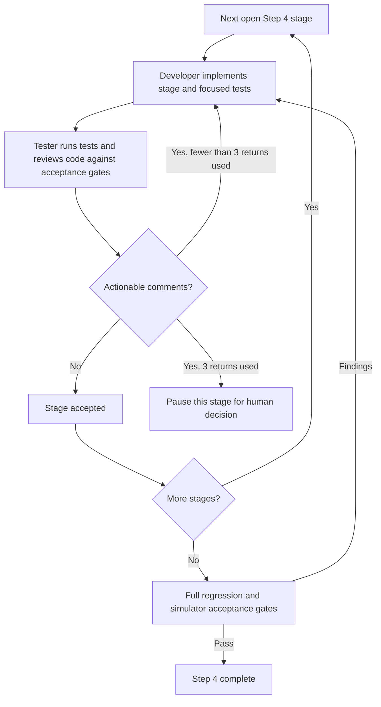

# GMX Step 4 implementation flow

**Objective:** Complete the read-only position simulator in this repository against the [Step 4 design](/home/vasilii/work/myOS/projects/crypto-yield/context/research/gmx/gmx-step-4-simulator-design.md). The primary agent coordinates two subagents named `developer` and `tester`.

The primary agent uses [the orchestrator skill](../.agents/skills/gmx-step4-orchestrator/SKILL.md), which loads the [developer](../.agents/agents/developer.md) and [tester](../.agents/agents/tester.md) role descriptions. [Stage status](step4-agentic-status.md) persists accepted stages and review return counts across sessions. These files guide subagent calls; they do not launch agents automatically.

## Roles and handoff

| Role | Responsibility |
|---|---|
| Primary agent | Select the next stage, keep implementation and review sequential, count tester-to-developer returns per stage, and update project status only after acceptance. |
| Developer | Implement one stage in the GMX code repository, add tests for behavior and failure paths, run focused checks, and hand over changed files, results, and unresolved evidence gaps. |
| Tester | Independently inspect the diff and relevant recording evidence, run appropriate tests, check the Step 4 acceptance gates, and return actionable findings with file and line references. |

The tester may return a stage to the developer **at most three times**. Each return increments that stage's counter. After the third revision, the tester reviews once more. If actionable findings remain, the primary agent pauses that stage and asks Vasilii to decide how to proceed. An accepted stage resets the counter for the next stage. The developer takes the next stage only after tester acceptance. The primary agent records the counter and review result in its handoff so the limit survives a session restart.

## Stage pipeline

| Order | Stage | Acceptance focus |
|---|---|---|
| 1 | Evidence adapter | Canonical recorded coordinates, same-transaction oracle ranges, block-versioned configuration, OI, pool and accrual state, and keeper opportunities; missing evidence is unavailable. |
| 2 | Position economics | Historical impact, fees, funding, borrowing, acceptable-price outcomes, and decrease settlement agree with selected validated orders. |
| 3 | Counterfactual market and position ledger | Simulated OI and pool effects stay separate from observed trader state; increases, partial decreases, full closes, collateral, payouts, and execution fees balance. |
| 4 | Risk monitor | Apply adverse oracle bounds after each replay state change; test liquidation before a pending stop and unavailable risk coverage. |
| 5 | Scenario runner and report | Run predeclared delay, gas, and parameter scenarios; produce the per-order ledger, risk time series, required metrics, and explicit unavailable outcomes. |
| 6 | Final integration | Replay recorded long and short examples, run full relevant tests and regression checks, and confirm all [Step 4 gates](/home/vasilii/work/myOS/projects/crypto-yield/context/research/gmx/gmx-step-4-simulator-design.md#acceptance-gates). |

The existing request scheduler is complete and serves as a dependency for Stage 1. No stage may claim a hypothetical fill from a request-time price or from a keeper candidate alone. Raw recordings and validation baselines stay authoritative. The workflow authorizes only offline research code; no wallet access, signing, order submission, or capital.
