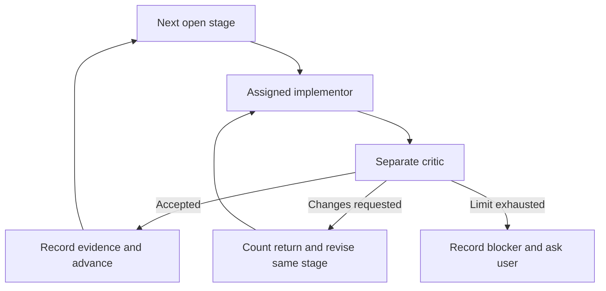

# Step 4.1 agentic flow

**Flow parameter:** `docs/step_4.1/step4-1-agentic-flow.md`

**State parameter:** `docs/step_4.1/step4-1-agentic-status.md`

**Plan:** [Cross-check plan](step4-1-simulation-router-crosscheck-plan.md)

The primary agent uses the [generic orchestrator skill](../../.agents/skills/gmx-step4-orchestrator/SKILL.md). Each stage has a separate implementor and critic. Code stages use the reusable [developer](../../.agents/agents/developer.md) and [tester](../../.agents/agents/tester.md) roles. Planning and integration stages use implementor and critic agents with the tasks below. The primary agent records handoffs and review results in the state file.

| Stage | Implementor type | Critic type | Acceptance focus |
|---|---|---|---|
| 0. Design and evidence contract | Implementor, documentation and evidence design | Critic, independent design review | Define exact order selection, latest-key proof, block-state equivalence, price provenance, report schema, and a feasible same-order reconstruction path. Identify unsupported assumptions before code. |
| 1. Candidate and evidence selection | Developer, code | Tester, code and data review | Read recorded `OrderCreated` keys and coordinates; classify four order categories and both eligibility gates; preserve deterministic skip reasons. |
| 2. GMX contract preflight | Developer, code | Tester, independent RPC and ABI review | Encode the documented router call, pin archive state, verify pending/latest key, decode all reverts, detect block-hash changes, and never send a transaction. |
| 3a. Pinned archive-state reader | Developer, code and state-key mapping | Tester, independent archive-state review | Map every state cell needed for a supported order type to historical GMX storage or a proved archive source. Read the order, position, market, configuration, open interest, liquidity, impact, accrual, referral, virtual inventory, and feature flags at one block hash. Check chain, deployment code, field keys, values, and block identity; fail closed on any missing or unproved cell. Mock tests verify key/value decoding and reorg handling; real provider evidence is reported separately. |
| 3b. Oracle evidence capture | Developer, code and oracle provenance | Tester, independent price and timestamp review | Capture complete integer min/max prices for the required token set, their valid timestamp interval, source, and scale proof for historical and watched requests. Match token order and values to router calldata. Reject stale, incomplete, duplicated, or unverified prices. Never substitute a display price or a price from another transaction without an explicit counterfactual label. |
| 3c. Independent decision adapter and CLI | Developer, code | Tester, independent comparison review | Wire the pinned reader and oracle evidence into the CLI. Run our own supported execution-validation rules for the same recorded order, with a coded list of required rules and state cells. Keep narrow acceptable-price diagnostics separate. Emit full `agreement` or `disagreement` only when all relevant rules and equivalent state are proved; otherwise emit `gmx_preflight_only` with an exact reason. Test both outcomes and unavailable paths end to end with mock RPC. |
| 3d. Reproducible contract comparison | Implementor, real evidence run | Critic, independent evidence reproduction | Run the September recording first, then the one-day backup and bounded watcher if needed. Preserve the order key, pinned block hash, deployment/code identity, oracle inputs, raw GMX revert, model inputs, and comparison result. Repeat at least one same-order comparison and independently check it. If archive access or an eligible order is unavailable, record the exact evidence gap and leave Step 4.1 open. |
| 4. Complete lifecycle examples | Developer, code and evidence search | Tester, independent lifecycle and risk review | Seek one complete long and one complete short open-to-close or supported liquidation example. Declare risk limits before selection; require every risk coordinate and a reproducible report. Record exact gaps if evidence prevents completion. |
| 5. Integration and user acceptance | Implementor, integration evidence | Critic, independent end-to-end review | Run relevant regressions, repeat the same-order GMX comparison, audit coverage and lifecycle claims against the plan's human-observable checks, and record final evidence or blockers. |

## How the stages match the plan's approach

| Approach in the cross-check plan | Work in this flow |
|---|---|
| **1. Add `gmx-router-check` with historical and bounded watch modes.** | The command and bounded log watcher exist. Watch mode does not yet capture verified oracle prices; Stage 3b must add that evidence. Neither mode may create an order, sign, or send a transaction. |
| **2. Select recorded orders and prove pending and latest at a pinned block.** | Stage 1 selects orders and saves their keys and coordinates. Stage 2 contains the archive checks, but no real order has passed them yet. |
| **3. Supply oracle prices and save the complete GMX result.** | Stage 2 contains call encoding and revert reporting. Stage 3b must supply and prove the price ranges and timestamps. No verified real call has been saved. |
| **4. Compare with our reconstruction only at equivalent pre-execution state.** | Stage 3a gathers and proves the relevant pinned state. Stage 3c runs our decision and compares it. Stage 3d repeats and independently reviews a real result. This remains the main unfinished work. |

Stages 3a–3d mainly implement and verify approach step 4. Stage 3b also finishes the price evidence needed for step 3 and watch mode. Acceptance of Stages 1 and 2 means their code passed review; it does not mean a real order or comparison has been verified.

## Handoff rules

The implementor changes only its assigned stage and reports changed files, commands, results, and evidence gaps. The critic reviews the actual diff and returns `ACCEPTED` or `CHANGES_REQUESTED` with file and line evidence. At most three critic-to-implementor returns are allowed per stage; after the third revision, one final critic review decides whether the stage is accepted or needs a human decision. A stage advances only after critic acceptance. The status file preserves counts across sessions.

The former single Stage 3 stopped after three returns and two user-authorized extra cycles. Its history stays in the status file. Stages 3a–3d are new, narrower work units, not an acceptance or counter reset for the former stage. Existing router, watcher, report, and rule-diagnostic code is a starting point. Each new stage has its own implementor and separate critic. The user reviewed this flow and authorized implementation to continue.

All chain interactions use read-only calls. A recent one-day recording is a backup after the September recording; a bounded live watcher is the next fallback. Missing archive access, missing oracle evidence, or no qualifying order is reported as an evidence gap. None of these can be converted into an agreement claim. The minimum Step 4.1 completion gate is one reproducible same-order comparison. Complete long and short lifecycles are separate evidence goals for this flow, and their absence must remain visible.
