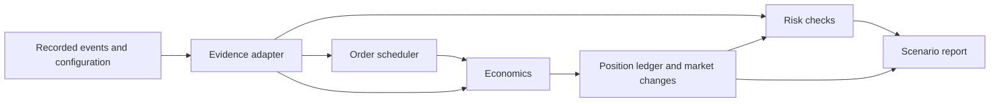

# Step 4 simulator architecture

## Purpose

The simulator tests planned GMX position orders against a recorded market period. It runs offline. It does not send orders or change the recording.

A scenario is one set of order requests and execution assumptions. The simulator gives each scenario its own position ledger and market changes. Recorded orders remain evidence. They do not become the simulated trader's orders.

## Order scope

Each position order has an **action** (increase or decrease), a **side** (long or short), and a GMX **order type**. These are separate choices. For example, a market increase can open a long or a short. An increase opens or adds size; a decrease reduces or closes size.

| Scenario request kind | GMX position order type | Current simulator behavior |
|---|---|---|
| `market_increase` | `MarketIncrease` | Models a long or short opening or increase when the required execution evidence is complete. |
| `market_decrease` | `MarketDecrease` | Models a long or short reduction or close for supported settlement shapes and complete evidence. |
| `take_profit` | `LimitDecrease` | Requires independent trigger evidence. The current recording adapter does not supply it, so this request returns `unavailable`. |
| `stop_loss` | `StopLossDecrease` | Requires independent trigger evidence. The current recording adapter does not supply it, so this request returns `unavailable`. |

The scenario runner does not currently accept `LimitIncrease` or `StopIncrease` as planned request kinds. It also does not model swaps or protocol liquidation as user orders. The [Step 4.1 cross-check plan](../step_4.1/step4-1-simulation-router-crosscheck-plan.md#order-types-and-current-support) lists the wider set of recorded GMX order types that its candidate selector can identify. Candidate selection alone does not mean that the Simulator can reconstruct that type.

## Data flow

The scenario runner controls this flow. It processes keeper candidates and risk checks in recorded order. A scheduler candidate is only a possible execution point. The economics and risk checks can reject it.

## Main parts

| Part | Code | Task |
|---|---|---|
| Evidence adapter | [`evidence.py`](../../src/gmx_crypto_bot_v2/simulation/evidence.py) | Load and check the recording. Give the state before a selected log. Supply keeper opportunities and required risk coordinates. |
| Order scheduler | [`orders.py`](../../src/gmx_crypto_bot_v2/simulation/orders.py) | Apply request timing, inclusion delay, keeper delay, triggers, and cancellation timing. Select a candidate opportunity. |
| Economics | [`economics.py`](../../src/gmx_crypto_bot_v2/simulation/economics.py) | Calculate execution price, price impact, fees, funding, borrowing, and position settlement. Check the acceptable price. |
| PnL cap | [`pnl_cap.py`](../../src/gmx_crypto_bot_v2/simulation/pnl_cap.py) | Limit positive position PnL with the historical market setting and market state. |
| Ledgers | [`ledger.py`](../../src/gmx_crypto_bot_v2/simulation/ledger.py) | Hold the simulated position and cash. Apply a supported fill to the position and market state. |
| Risk checks | [`risk.py`](../../src/gmx_crypto_bot_v2/simulation/risk.py) | Estimate adverse close value, remaining collateral, leverage, and liquidation state. |
| Scenario runner | [`scenarios.py`](../../src/gmx_crypto_bot_v2/simulation/scenarios.py) | Run the parts in order. Record orders, risk points, reasons, and metrics. |

## Historical evidence

The adapter uses a coordinate with three numbers: block, transaction index, and log index. `at(coordinate)` gives the state before that log. `state_for_opportunity()` gives the state before the position log for a keeper opportunity.

The state includes oracle prices, market configuration, fee accrual, open interest, pool amounts, and impact pool amount. The adapter also supplies historical risk settings, virtual inventory, and referral terms where the recording supports them.

Oracle prices belong to a transaction. The adapter does not use a price from another transaction as a substitute. If a required input is absent or inconsistent, the adapter reports `UnavailableEvidence`.

## One scenario run

Open the [interactive scenario run](step4-scenario-run.html) to follow these steps and inspect four possible paths.

1. The runner gets keeper opportunities from the evidence adapter.
2. The scheduler tests each planned request. It returns a candidate, a missed request, or an unavailable result.
3. The runner checks that the declared risk coordinates match the recorded state changes.
4. At a candidate, the runner gets the recorded state. It applies earlier simulated market changes to that state.
5. If a position is open, the runner checks its risk before the pending order can execute.
6. The economics module calculates the candidate order. The ledger posts the fill only when the result is eligible.
7. At each required risk coordinate, the runner checks the open position. It settles a supported liquidation when the position is liquidatable.
8. The runner builds the report. It calculates final metrics only when the path has full coverage.

The runner places candidate actions and risk actions in coordinate order. It stops later fills after an open position reaches an unresolved risk gap or unsupported liquidation settlement.

## Simulated state and cash

`CounterfactualBook` holds the simulated changes to market open interest, pool amounts, and impact pool amount. It applies these changes to each new recorded state. This keeps the historical market state and the simulated effects separate.

`PositionLedger` holds position size, position tokens, collateral, USDC cash, and ETH cash. `apply_fill()` changes the position and market book together. The economics result has a digest that ties it to the state used for the fill.

The simulator records execution fees in ETH and position cash flows in USDC. The report values ETH cash with an ETH oracle price when it calculates net results.

## Risk and unavailable results

The risk check uses an adverse oracle bound for the position side. It includes capped PnL, fees, funding, borrowing, and full close price impact. It then tests remaining collateral and the liquidation limit. A pending stop order does not remove liquidation risk before that order executes.

The simulator uses `unavailable` when required evidence or a supported accounting path is absent. It does not turn a scheduler candidate into a fill in that case. It also leaves final metrics empty when the scenario path is incomplete.

The selected September long and short paths stop at the first risk coordinate without a complete oracle price set in that transaction. The coordinates are `(507378205, 2, 9)` and `(508760311, 6, 22)`. The pending closes do not execute after these gaps. See the [integration evidence audit](step4-final-integration-evidence.md) for the recorded checks and remaining limits.

## Output and comparison

`ScenarioReport` contains an order record for each planned request, risk records, status, reasons, and metrics. A filled order records its evidence coordinate, selected configuration, price, impact, fees, cash flows, and ledger state.

The scenario grid varies inclusion delay, keeper delay, execution fee, acceptable price, and strategy parameters. The runner uses the same recorded evidence for each scenario. A complete report can compare net PnL, collateral return, drawdown, exposure, fees, funding, borrowing, impact, liquidation count, and time near the liquidation limit.

The recorded order validator checks observed orders. The simulator uses those checks as evidence for its calculation rules. A match with a recorded order does not prove that every hypothetical scenario has complete evidence.
